# feat: Add theme preset picker

## Overview

Replace the header's cycle-only theme toggle with a controlled, header-anchored picker that surfaces all 15 existing theme choices (System, Light, Dark, and 12 named presets) through the existing theme system. No revival of the full theme customizer flow.

## Problem Frame

The shipped header control only cycles between light, dark, and system preference; the 12 preset themes already defined in `src/utils/preset-themes.ts` are unreachable from that control. Theme mode and custom-theme override are tracked as two separate pieces of state, so they can disagree about which theme is actually active (for example, a stale preset override outliving a mode change). The full `ThemeCustomizer` exists but carries modal dialog, color-editing, and staged-apply/cancel complexity that isn't needed to let a visitor pick from a fixed list of 15 choices.

## Requirements Trace

**Access and structure**
- R1. A single header button replaces the current cycle-only toggle and opens a theme picker.
- R2. The picker is a compact, non-modal surface rather than a full-page or full-screen dialog.
- R3. The picker lists exactly System, Light, Dark, and all 12 existing named presets, with no search or filter control.

**Selection behavior**
- R4. Only one choice is active and restored at a time; selecting System, Light, or Dark clears any preset override, and selecting a preset makes that preset the sole active choice.
- R5. Selecting an option applies and persists the theme immediately without a separate confirmation action; reloading restores that exact last choice.
- R6. The picker remains open after a selection so the visitor can continue comparing other options; selecting the active choice again leaves state unchanged.
- R7. Dismissing the picker never reverts or undoes the currently selected theme.

**System behavior**
- R8. When System is active, the rendered theme tracks the OS light/dark preference in real time.
- R9. When a preset, Light, or Dark is active, the rendered theme stays fixed when the OS preference changes.
- R10. With no stored preference, System remains active across reloads until the visitor selects another choice.

**Interaction and accessibility**
- R11. The picker follows a single-select keyboard model: arrow keys move between choices, Enter or Space selects, and Tab can leave without trapping focus.
- R12. The picker closes via Escape, Tab focus leaving the picker, an outside click/tap, or the trigger button; only Escape forces focus back to the trigger.
- R13. The active choice is conveyed visually and through programmatic selected state, and the trigger's accessible name identifies the current choice.
- R14. The picker stays within desktop and mobile viewports, uses internal scrolling when height is constrained, keeps visible focus indicators, and introduces no motion beyond existing reduced-motion-aware theme transitions.
- R15. If an unrecognized user-authored custom theme is active, the picker preserves it and shows a read-only "Current: Custom theme" status outside the 15 listed choices until the visitor deliberately selects one.

**Success criteria**
- Visitors can reach and apply any of the 15 choices (System, Light, Dark, and 12 presets) through one header control, with no theme left unreachable.
- Visitors can compare several themes without reopening the picker, and choosing a mode never leaves a stale preset override active.
- The picker meets WCAG 2.1 AA expectations for keyboard operability, focus management, and screen-reader state announcement.
- The active theme choice and its persistence behavior are unambiguous at all times, both visually and programmatically, across reloads.

## Scope Boundaries

- No activation of the full `ThemeCustomizer` flow (custom color editing, saved-theme library, import/export, Apply/Cancel semantics).
- No dedicated home section or standalone route for theme selection — the picker is header-anchored only.
- No search or filter controls within the picker.
- No temporary hover/focus preview or confirmation step before a selection applies.
- No change to the existing preset catalog (still exactly 12 named presets plus System/Light/Dark).
- No new picker animation beyond the existing reduced-motion-aware theme transitions.
- No migration or editing support for user-authored themes created by the dormant customizer; existing values are preserved only until the visitor selects a listed choice.
- No new dependency.
- No expansion of telemetry/analytics beyond the existing `analytics.trackThemeChange` call already fired by `setThemeMode`.
- No activation, refactor, or mounting of `ThemeCustomizer` or reuse of its staged-state model.
- No change to `PresetThemeGallery` search/preview behavior — it is a separate, larger surface and stays out of this work.
- No new persistence schema, storage key, or migration path beyond reconciling the two existing keys (`mrbro-dev-theme-mode`, `mrbro-dev-custom-theme`).
- No broad cleanup or refactor of the theme system beyond what this feature requires.

## Context & Research

### Relevant code and patterns

- `src/contexts/ThemeContext.tsx` — `ThemeProvider` (owns `themeModeValue`/`customThemeValue` state, `setThemeMode`, `setCustomTheme`, cross-tab `handleStorageChange`, system-preference `detectSystemPreference`/`handleChange`, CSS custom property application).
- `src/hooks/UseTheme.ts` — `useTheme` (`UseThemeReturn` compound API: `currentTheme`, `themeMode`, `isCustomTheme`, `setThemeMode`, `setCustomTheme`, `getEffectiveThemeMode`, mode-check booleans).
- `src/components/ThemeToggle.tsx` — current three-mode cycle button (`handleToggle`, `getAriaLabel`, `getThemeIcon`, `getCurrentThemeDescription`); the component to move/rename.
- `src/components/Header.tsx` — `Header`, mounts `ThemeToggle` inside `.header__actions`.
- `src/utils/theme-storage.ts` — `STORAGE_KEYS` (`THEME_MODE` = `mrbro-dev-theme-mode`, `CUSTOM_THEME` = `mrbro-dev-custom-theme`), `saveThemeMode`, `loadThemeMode`, `saveCustomTheme`, `loadCustomTheme`, `removeCustomTheme`.
- `src/utils/preset-themes.ts` — `presetThemes` (12-entry array), `getPresetThemeById`, `getPresetThemesByMode`.
- `src/components/PresetThemeGallery.tsx` — existing gallery pattern with search/filter (`PresetThemeCard`, `PresetThemeGalleryProps`) — reference for visual language only, not to be reused directly per scope boundaries.
- `src/types/theme.ts` — `ThemeMode`, `Theme`, `ThemeContextValue`, `ThemePreset`.
- `src/styles/globals.css`, `src/styles/themes.css` — token and layout conventions to follow for the new picker surface.
- Tests: `tests/hooks/UseTheme.test.tsx`, `tests/components/ThemeToggle.test.tsx`, `tests/components/Header.test.tsx`, `tests/components/PresetThemeGallery.test.tsx`, `tests/e2e/theme-switching.spec.ts`, `tests/e2e/responsive.spec.ts`, `tests/accessibility/keyboard-navigation.spec.ts`, `tests/accessibility/focus-management.spec.ts`, `tests/accessibility/screen-reader.spec.ts`, `tests/visual/components.spec.ts`.

### Institutional learnings

No matching prior fix exists under `docs/solutions/`; this is new surface area. The origin brainstorm (`docs/brainstorms/2026-07-19-theme-preset-picker-requirements.md`) remains the source of truth for behavior and acceptance examples; this plan does not reinterpret its requirements.

### External references

- WAI-ARIA Authoring Practices Guide, Listbox pattern — informs the single-select `listbox`/`option` roles, roving focus, and explicit Enter/Space activation used for the 15 mutually exclusive choices.
- WHATWG HTML Popover attribute / MDN Popover API — evaluated as an alternative dismissal/positioning mechanism; not adopted (see Key Technical Decisions). No third-party library documentation is needed.

## Key Technical Decisions

- **React-controlled header-anchored overlay, not the native Popover API or a new dependency.** A controlled `open` boolean anchored to the header trigger gives predictable positioning and straightforward testability with the existing React Testing Library/Playwright setup. The overlay still follows the same dismissal and focus-management behavior a native popover would provide (outside click, Escape, focus return) so behavior stays standards-aligned without adopting a new browser API surface or dependency.
- **Single-select `listbox`/`option` semantics with roving focus and explicit activation.** On open, focus starts on the selected option or the first listed option when a legacy custom theme is active. Arrow keys move focus without applying a theme; Space/Enter applies the focused option. Tab exits and closes the picker without stealing focus from the visitor's next target. Escape closes the picker and returns focus to the trigger. No live region is added, because `aria-selected` plus the trigger's dynamic accessible name communicate the current choice per R13.
- **Preserve the existing dual persistence (`mrbro-dev-theme-mode` + `mrbro-dev-custom-theme`), reconciled rather than replaced.** Selecting a mode updates both in-memory values together, saves the new mode, then removes the custom-theme key so remote tabs retain the prior rendered theme until the final mode choice is committed. On any relevant storage event, the provider re-reads both keys and resolves them through the same custom-over-mode precedence used at startup. A preset remains stored as the custom-theme override and wins restoration over any dormant mode value. No new storage key or migration is introduced.
- **Active-choice resolution is a domain-level derived value.** `useTheme` exposes one discriminated active-choice result that distinguishes mode, recognized preset (ID present in `presetThemes`), and unrecognized user-authored custom theme. The picker consumes that value rather than duplicating ID/preference logic; the legacy custom state is read-only-displayed outside the 15 listed choices until explicit selection.
- **The new compact picker reuses preset data and existing visual language only** — it does not refactor or mount `PresetThemeGallery`, `ThemePreview`, or `ThemeCustomizer`. A small extraction (e.g., a shared color-swatch renderer) is acceptable only if implementation proves it is clearly cheaper than duplicating a few lines; it is not assumed up front.
- **No new dependency** is added for overlay positioning, focus trapping, or radio-group behavior; all interaction logic is implemented with existing React/DOM primitives.

## Open Questions

### Resolved during planning

- Overlay mechanism: controlled React overlay, not native Popover API (see Key Technical Decisions).
- Interaction semantics: single-select `listbox`/`option` with roving focus, explicit Enter/Space activation, and no live region.
- Storage model: reconcile existing two keys; no new schema.
- Unknown custom theme handling: preserved and shown as read-only status outside the 15 choices.
- Reuse posture toward `PresetThemeGallery`/`ThemeCustomizer`: visual-language reference only, no mounting or refactor.
- Test scope: unit/component tests cover all 15 choices individually; browser-level (E2E/accessibility/visual) suites use representative themes rather than a full cross-product.

### Deferred to implementation

- Final arrangement of the compact picker's 15 options (grouping/ordering of System/Light/Dark versus presets, swatch sizing) — implementation detail, no product behavior may change.
- Precise CSS values for overlay positioning and viewport-edge collision handling (offsets, max-height for internal scrolling) — implementation detail, must still satisfy R14 (viewport containment, internal scrolling, visible focus).

## High-Level Technical Design

The picker is a thin interaction layer over the existing theme state machine. Conceptually, the system has three mutually exclusive active-choice categories driven by the same underlying `ThemeProvider` state (`themeModeValue`, `customThemeValue`):

```mermaid
stateDiagram-v2
    [*] --> Mode : first visit, System active

    state "Mode (System / Light / Dark)" as Mode
    state "Recognized Preset Active" as Preset
    state "Legacy Custom (read-only)" as LegacyCustom

    Mode --> Mode : select System/Light/Dark (clears preset override)
    Mode --> Preset : select one of 12 presets
    Preset --> Preset : select a different preset
    Preset --> Mode : select System/Light/Dark (clears preset override)
    LegacyCustom --> Mode : select System/Light/Dark
    LegacyCustom --> Preset : select a preset
    LegacyCustom --> LegacyCustom : picker opens, no selection made
```

This diagram is directional guidance for how the picker's selections map onto existing provider state, not an implementation spec. System mode continues to track OS preference live; `Preset` and non-system modes stay fixed regardless of OS changes; `LegacyCustom` only exists when a stored custom theme's `id` is not a recognized preset, and is exited the moment the visitor selects any of the 15 listed choices.

## Implementation Units

- [x] **Unit 1 — Reconcile active theme state and persistence**

  **Goal:** Ensure `ThemeProvider`/`useTheme` expose one unambiguous active choice (mode or recognized preset) and that selecting a mode always clears a stale preset override, per R4, R5, R8–R10, R15.

  **Requirements:** R4, R5, R8, R9, R10, R15.

  **Dependencies:** None (foundation for Units 2–4).

  **Files:** `src/contexts/ThemeContext.tsx`, `src/hooks/UseTheme.ts`, `src/types/theme.ts`, `src/utils/theme-storage.ts` — modify only where needed to support reconciliation; no unrelated changes.

  **Approach:** Extend `setThemeMode` so it updates the mode and clears the in-memory custom override as one React state transition, then persists the mode before removing the custom-theme key. Keep the public `setCustomTheme` contract non-nullable; clearing remains an internal mode-selection responsibility rather than a new public API. Ensure preset selection continues through `setCustomTheme` and retains current custom-over-mode restoration precedence. Change `handleStorageChange` to re-read both persisted values for either theme key and resolve the pair with the same precedence as initialization. Add a discriminated active-choice value to `useTheme` that distinguishes mode, recognized preset (`id` found through the preset catalog), and unrecognized legacy custom theme.

  **Execution note:** Test-first — write the scenarios below against the current `ThemeProvider`/`useTheme` behavior before changing `setThemeMode`, so the clearing behavior is proven by a failing test first.

  **Patterns:** Follow the existing `useCallback`-wrapped setter pattern in `ThemeProvider`; keep persistence side effects inside the same setters rather than in consuming components.

  **Test scenarios** (in `tests/hooks/UseTheme.test.tsx`; add a context-specific test file only if this hook-level harness cannot exercise `ThemeContext`/storage interaction directly):
  - *State reconciliation:* selecting a mode while a preset is active clears the in-memory custom theme and removes `mrbro-dev-custom-theme` from storage.
  - *Persistence:* a selected preset remains the active theme after a simulated reload (storage re-read).
  - *Precedence:* a recognized preset value in storage wins over a stale mode value in storage on load.
  - *Mode-after-preset:* selecting a mode after a preset was active results in only the mode being restored on the next load (no preset residue).
  - *First visit:* with no stored preference, `themeMode` is `system` and the rendered theme tracks OS preference (R8, R10).
  - *Preset fixed:* with a preset active, a simulated OS preference change does not alter the rendered theme (R9).
  - *Unknown custom preserved:* a custom theme with an `id` absent from `presetThemes` is preserved as-is and is identifiable as "not a recognized preset" via the derived signal.
  - *Internal clear contract:* selecting any mode removes the persisted `mrbro-dev-custom-theme` key without widening the public `setCustomTheme` API.
  - *Cross-tab convergence:* simulated `storage` events for either key cause both keys to be re-read; a recognized preset remains active over a dormant mode, while a saved mode plus removed custom key resolves directly to the mode without exposing stale contradictory state.

  **Verification:** Unit test suite for `tests/hooks/UseTheme.test.tsx` (and any added context test) passes; no change to unrelated `ThemeProvider` behavior (transitions, analytics call in `setThemeMode`) is introduced.

- [x] **Unit 2 — Replace cycle toggle with compact accessible picker**

  **Goal:** Deliver the header-anchored, non-modal picker exposing all 15 choices with full keyboard/radio-group semantics, per R1–R3, R6, R7, R11–R13, R15.

  **Requirements:** R1, R2, R3, R6, R7, R11, R12, R13, R15.

  **Dependencies:** Unit 1 (relies on reconciled state and the recognized-preset/legacy-custom derived signal).

  **Files:** Move/rename `src/components/ThemeToggle.tsx` → `src/components/ThemePicker.tsx`, and correspondingly move/rename `tests/components/ThemeToggle.test.tsx` → `tests/components/ThemePicker.test.tsx`; modify `src/components/Header.tsx` and `tests/components/Header.test.tsx` for the renamed mount. No orphaned compatibility exports or dual components should remain — this is a move, not a new parallel component.

  **Approach:** Build the trigger button plus a controlled overlay (`open` boolean state) listing System, Light, Dark, and the 12 entries from `presetThemes` as `option` children of a single-select `listbox`. Wire selection to the reconciled actions and active-choice value from `useTheme`. On open, move focus to the selected option or the first option when no listed choice is selected; implement roving tabindex and arrow-key navigation across all 15 options without applying on focus alone; Enter/Space selects the focused option and keeps the picker open; selecting the already-active option is a no-op that leaves state unchanged. Dismissal has one explicit focus rule per path: Escape closes, waits until the controlled overlay is removed, then restores the trigger; Tab and outside-pointer dismissal close without invoking trigger focus; trigger-button dismissal leaves focus on the already-focused trigger. When the active theme is an unrecognized legacy custom theme, render the "Current: Custom theme" read-only status outside the 15 options and ensure selecting any listed choice replaces it. The trigger's accessible name reflects the current active choice (mode label, preset name, or custom status).

  **Execution note:** Test-first — write and run the scenarios below against the moved test file before implementing the new interaction logic, since this is the highest-risk accessibility surface in the feature.

  **Patterns:** Reuse the existing `data-testid` and ARIA-labeling conventions from the current `ThemeToggle`; follow `PresetThemeGallery`'s data-driven rendering of `presetThemes` for the option list without importing its component.

  **Test scenarios** (in `tests/components/ThemePicker.test.tsx`):
  - *Open/close:* trigger click opens the picker; trigger click while open closes it.
  - *Completeness:* all 15 choices (System, Light, Dark, 12 presets) are rendered as listbox options.
  - *Active state:* the currently active choice has `aria-selected="true"` and is visually marked; only one option is selected at a time.
  - *Initial focus:* on open, focus moves to the selected item and it is scrolled into view if needed; a legacy custom theme focuses the first listed option without selecting it.
  - *Keyboard navigation:* arrow keys move focus between options and wrap at the ends without applying a new theme.
  - *Activation:* Enter and Space both select the focused option.
  - *No-op reselect:* selecting the already-active option does not change state or close the picker.
  - *Stays open:* selecting a different option keeps the picker open (R6).
  - *Escape:* closes the picker and returns focus to the trigger.
  - *Tab/outside dismissal:* Tab moves focus out of the picker and closes it without redirecting focus; a simulated outside click closes it without moving focus to the trigger.
  - *Legacy custom status:* when an unrecognized custom theme is active, "Current: Custom theme" renders outside the 15 choices; selecting any choice removes that status and activates the choice.
  - *Persistence wiring:* selecting a mode calls `setThemeMode`; selecting a preset calls `setCustomTheme` with the matching preset object.

  **Verification:** `tests/components/ThemePicker.test.tsx` passes; `tests/components/Header.test.tsx` updated for the renamed import/mount and passes; no remaining references to `ThemeToggle` in source or tests.

- [x] **Unit 3 — Add responsive visual treatment**

  **Goal:** Style the picker to fit the header's existing visual language across viewport sizes while satisfying R2, R14.

  **Requirements:** R2, R14.

  **Dependencies:** Unit 2 (styles target the rendered picker markup).

  **Files:** `src/styles/globals.css`, `src/styles/themes.css`; update `tests/components/Header.test.tsx` only if the picker's presence changes header DOM structure assertions; extend `tests/visual/components.spec.ts` (or the nearest existing theme-focused visual spec) with picker screenshots.

  **Approach:** Style the trigger to preserve its current footprint in `.header__actions`. Style the overlay as a compact, non-modal panel anchored below/near the trigger, using existing theme-aware CSS custom properties (`--color-surface`, `--color-border`, `--color-text`, etc.) so it renders correctly across every active theme. Apply a `max-height` with internal scrolling for short viewports so all 15 options stay reachable without page-level overflow. Preserve visible focus indicators on both the trigger and each radio option. Do not introduce inline styles, decorative gradients, or any customizer-style editing UI; do not add new transition/animation beyond what the reduced-motion-aware theme transition system already provides.

  **Test scenarios / verification** (browser evidence required, not just file existence):
  - Representative screenshots: default Light, default Dark, and two contrasting presets (one light, one dark) with the picker closed and open.
  - Desktop and mobile viewport screenshots of the open picker.
  - Short mobile viewport screenshot demonstrating internal scrolling reaches all 15 options without page-level horizontal overflow.
  - Confirmation (via screenshot or DOM check) that no header or page-level overflow is introduced when the picker is open.
  - Confirmation that focus indicators remain visible when the active theme changes while the picker is open.

- [x] **Unit 4 — Verify cross-layer interaction and accessibility**

  **Goal:** Validate the reconciled state (Unit 1), interaction model (Unit 2), and visual treatment (Unit 3) together in real browser conditions, closing out R5, R7–R9, R11–R15 and the success criteria.

  **Requirements:** R5, R7, R8, R9, R11, R12, R13, R14, R15, plus the four Success Criteria.

  **Dependencies:** Units 1–3.

  **Files:** Modify only the existing browser suites actually needed to cover new scenarios: `tests/e2e/theme-switching.spec.ts`, `tests/e2e/responsive.spec.ts`, `tests/accessibility/keyboard-navigation.spec.ts`, `tests/accessibility/focus-management.spec.ts`, `tests/accessibility/screen-reader.spec.ts`. Avoid duplicating scenarios already proven at the unit/component level in Units 1–2; these suites exist to prove end-to-end and real-browser behavior (focus, storage, OS media-query response) that jsdom-based unit tests cannot fully verify.

  **Test scenarios:**
  - *Persistence across reload:* select a preset, reload the page, confirm the preset is still active (R5).
  - *Preset-to-mode clearing:* select a preset, then select a mode, reload, confirm only the mode persisted (R4, R5).
  - *System responsiveness vs. fixed choices:* with System active, simulate an OS preference change and confirm the rendered theme updates; with a preset active, confirm the same OS change has no effect (R8, R9).
  - *Legacy custom replacement:* seed an unrecognized custom theme in storage, load the page, confirm the read-only status appears, then select a listed choice and confirm it's replaced (R15).
  - *Rapid comparison:* select several presets/modes in sequence while the picker remains open, confirming each selection applies, the selected/focused state remains synchronized, and the panel remains legible and within the viewport as its own theme tokens change (R6, R13, R14).
  - *Dismissal focus behavior:* Escape returns focus to the trigger; Tab moves focus onward and closes the picker; outside click closes without hijacking focus (R7, R11, R12).
  - *Mobile/touch:* open the picker on a short touch/mobile viewport, scroll to and select the final option, and confirm it remains visible while the picker stays open, all options remain reachable, and the underlying page does not scroll horizontally or chain the gesture unexpectedly (R14).
  - *Accessible state:* the trigger and listbox options expose correct accessible name/state via automated accessibility scan (R13).
  - *No critical axe issues:* automated accessibility audit of the open picker reports no critical/serious violations.
  - *Visual regression:* representative before/after comparison confirms no unintended layout shift in the header across the suites already tracking header/theme visuals.

  Cover every one of the 15 presets/modes at the unit level (Units 1–2); this unit's browser matrix should use a representative subset (e.g., System, one non-system mode, two contrasting presets) rather than a full 15-theme cross-product per browser.

  **Verification:** All listed suites pass in the existing browser test runner with real screenshots and structured accessibility results attached as evidence; no unit relies on asserting file existence or static markup alone.

## System-Wide Impact

- `ThemeContext`/`ThemeProvider` is mounted once and affects every route; behavior changes here (mode clearing a preset override) apply globally, not just where the picker is visible.
- `Header` renders on every route, so the picker replaces the toggle everywhere the current toggle appears.
- Cross-tab `storage` event handling and theme-switch CSS-transition behavior in `ThemeProvider` are exercised more heavily (more distinct theme values to cycle through) but are not structurally changed beyond the mode-clears-preset reconciliation in Unit 1.
- `ThemeCustomizer` and its saved-theme library remain compile-compatible and unmounted; this feature does not activate or route to them.
- Any direct imports of `ThemeToggle` (component or test) must be updated to `ThemePicker` as part of the Unit 2 rename; a repo-wide check for lingering `ThemeToggle` references is part of that unit's verification.
- No API, network, backend, or deployment configuration changes are required.
- No telemetry/analytics expansion; the existing `analytics.trackThemeChange` call in `setThemeMode` continues to fire unchanged.

## Risks & Dependencies

| Risk / Dependency | Mitigation |
| --- | --- |
| Stale dual state (mode + custom theme disagree) resurfacing after Unit 1 | Unit 1's test-first scenarios explicitly cover mode-clears-preset and preset-wins-over-stale-mode precedence before Unit 2 builds on it. |
| Cross-tab `storage` event ordering causing a flicker between mode and preset | Cross-tab convergence scenario in Unit 1 asserts final state correctness regardless of event arrival order; Unit 4 validates in a real browser. |
| Unrecognized legacy custom theme mishandled (lost or wrongly treated as a preset) | Dedicated derived signal in Unit 1 plus explicit read-only-status test scenarios in Units 1, 2, and 4 (R15). |
| Focus/outside-click ordering bugs (focus stolen or lost on dismissal) | Explicit Escape/Tab/outside-click scenarios in Unit 2 (component-level) and Unit 4 (real browser) before considering the unit complete. |
| Picker contrast/legibility breaking when the active theme itself changes mid-interaction | Unit 3 requires representative light/dark/preset screenshots with the picker open; Unit 3 verification explicitly checks focus visibility as the theme changes. |
| Mobile viewport height causing scroll-chaining or page-level overflow | Unit 3 requires a short-viewport screenshot proving internal scrolling without page overflow; Unit 4 repeats this in a real mobile browser context. |
| Visual regression baseline churn from replacing the toggle's markup | Unit 3 updates `tests/visual/components.spec.ts` (or nearest theme spec) baselines deliberately as part of the unit, not as an incidental side effect discovered later. |
| Rename fallout (`ThemeToggle` → `ThemePicker`) leaving broken imports or duplicated test files | Unit 2 explicitly treats this as a move, verifies no orphaned `ThemeToggle` references remain, and updates `Header.test.tsx` accordingly. |

## Documentation / Operational Notes

- No user-facing documentation changes are anticipated beyond this plan and its origin requirements document, unless implementation introduces new visitor-facing copy (e.g., status text) that diverges from what's specified in R15 — in that case the exact wording should be confirmed against the origin doc's acceptance examples.
- Verification for Units 3 and 4 requires actual browser screenshots and structured accessibility scan output as evidence; static assertions alone are not sufficient sign-off for those units.
- The existing 12-entry preset catalog (`src/utils/preset-themes.ts`) is unchanged by this work; no new preset themes are added or removed.

## Sources & References

- `docs/brainstorms/2026-07-19-theme-preset-picker-requirements.md` (origin requirements)
- `docs/plans/2026-07-18-003-refactor-trim-home-sections-plan.md` (prior related plan referenced in origin doc's Sources/Research)
- `.ai/plan/feature-theme-system-1.md` (original theme system plan referenced in origin doc's Sources/Research)
- `src/contexts/ThemeContext.tsx`
- `src/hooks/UseTheme.ts`
- `src/components/ThemeToggle.tsx`
- `src/components/Header.tsx`
- `src/utils/theme-storage.ts`
- `src/utils/preset-themes.ts`
- `src/components/PresetThemeGallery.tsx`
- WAI-ARIA Authoring Practices Guide — Listbox Pattern: https://www.w3.org/WAI/ARIA/apg/patterns/listbox/
- WHATWG HTML Standard — Popover attribute: https://html.spec.whatwg.org/multipage/popover.html
- MDN — Popover API: https://developer.mozilla.org/en-US/docs/Web/API/Popover_API
